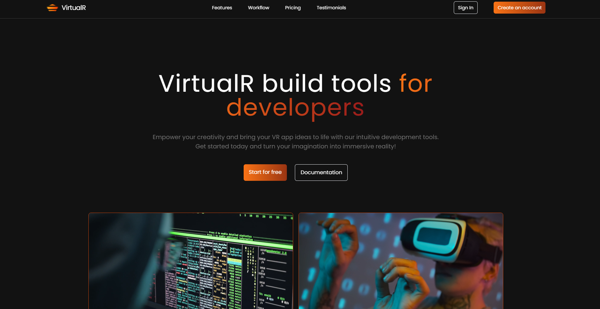

# React Landing Page

### Overview 📋
A simple landing page created to practice my front-end skills.

### Purpose 🎥
While getting familiar with TailwindCSS, I decided to build this page, which greatly helped me understand the framework better.

### 🛠️ Built With:
- React/Vite
- TailwindCSS

## Screenshots 📸
Here are two screenshots of this project. If you'd like to try it for yourself, just [click here](https://react-landing-pearl.vercel.app/).

